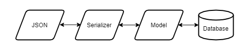

# Pokemon GO
This is a basic implementation of Pokemon GO, where you find Pokemon based on what region you are in. This is a Python console app where the user chooses from a list of Pokemon habitats. This app leverages PokeAPI ([https://pokeapi.co/](https://pokeapi.co/)) to get data.

## Usage
```bash
python3 -m venv env
source env/bin/activate
pip3 install requirements.txt
# Create SQLite database
python3 main.py migrate
# Run program
python3 main.py
```

## Pedagogy
I wrote this as a vehicle for preparing to work with Django.

#### Background Knowledge
Students have a good grasp of Object-Oriented and Functional Programming in another language (JavaScript). They know how to implement basic programming constructs in Python but have not worked with objects or modules yet.

#### Learning Objectives
* Learn how to create and use Python objects.
* Learn how to create a Python module and use relative and absolute imports.
* Learn how to handle data flow from receiving JSON with a GET request to saving a SQLite database record (see picture below). This is in preparation for working with Django's ORM and Django REST Framework's Serializers. Students will also learn the dangers of SQL Injection, etc. and how Django's ORM combats this.


---

### Day 1
Set up virtual environment
Write `get_habitat` (`main.py`)

* Topics: Functions, Variables, Loops, Conditionals, requests library, dicts and lists
* Do the pseudo code together

### Day 2
Write `get_pokemon_from_habitat(habitat)` (`main.py`)

* Topics: fstrings, random choice
* Do the pseudo code together
* Students should be able to get most of this code on their own

### Day 3
Write `PokemonModel` class in `orm.py`

* Topics: OOP, fields, methods, instantiation, Python modules
* Students should choose at least one more field than what's defined here
* Try instantiating objects at the bottom of `orm.py`
* Give them `utils.py`
* Import `orm.py` and comment out current entry point in `main.py` to test

### Day 4
Write `PokemonSerializer` class in `orm.py` and test it out in `main.py`

* A serializer takes a Python object and converts it to JSON
* Deserializing is taking JSON and converting it to a Python object (this is what we will be doing)
* We won't have any input validation
* The serializer needs to find English flavor_text. Test with 'https://pokeapi.co/api/v2/pokemon-species/173/'

### Day 5
Write the database commands

* `serializer.save`, `try/except`, sys.argv in `main.py`
